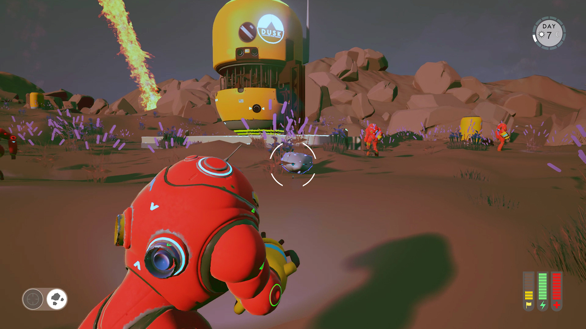

**Copyright (c) 2017 Improbable.**

**The DUSK project is no longer maintained and is not compatible with current versions of SpatialOS.**
If you would like to see a simple example of an Unreal integration, please have a look at the [RPG Demo](https://github.com/spatialos/RPGDemo).

# DUSK (SpatialOS)

*****

This project is licensed under the terms of the MIT license.
* GitHub Repository:  [https://github.com/spatialos/ue4-demo-dusk](https://github.com/spatialos/ue4-demo-dusk)

*****

### Introduction

This is a repository of the DUSK Unreal Engine demo, showcasing a game-jam developed project with experimental SpatialOS Unreal Integration.

### Documentation

Documentation explaining how to build this project for SpatialOS can be found [here](https://spatialos.improbable.io/docs/reference/10.1/experimental/unreal/setup-example-projects).

The main documentation for SpatialOS can be found by clicking on [this link](https://spatialos.improbable.io/docs/reference/latest/index).

### Controls

+ Use WASD to move.
+ Click right mouse button to aim.
+ Click left mouse button to fire.
+ Hold left mouse button to use Grav Gun.
+ Shift to toggle between Plasma Rifle/Grav Gun.
+ Space for jetpack.

### Gameplay
+ Feed rocks (spawned from asteroids) to the Blender to get batteries.
+ Feed batteries (spawned by Blender) to the generators to fire up forcefields.
+ Defend the Blender - if damaged, takes time to power back up.
+ Defend generators - if damaged needs replacement batteries.
+ Defend HQ.
+ Shoot Mantises.
+ Collect rocks.
+ Avoid Mantis attacks.
+ Day/night clock indicates how many days have passed.
+ Pop-up indicates when base is being attacked.
+ Mantises awake at night, asleep in the day - seek out remaining Mantises before next attack.

*****

## Known Issues

### Graphical 

+ UI death screen offset.
+ UI death screen timer.
+ Battery distance to arm too long.
+ Aiming offset needs fixing on reticule.
+ Static daytime pose for Mantis floats above ground slightly.
+ Iron sights animation pose jitters slightly.

### Gameplay 

+ Mantises sometimes ignore player.
+ Rocks are not always spawned by asteroids.
+ Base Attack warning delayed.
+ Limited number of Mantises moving in closed state during day.
+ Pig spits 2 batteries per rock.
+ Healthy generators batteries even at 100% health.
+ Asteroid-spawned resources currently are large in number and may affect frame-rate.

### Misc. 

+ The Unreal Engine garbage collection may cause issues with workers and/or clients failing. This may require players to reconnect.
+ The `workers/unreal/SourceOverrides` folder currently replaces certain files from the SpatialOS Unreal SDK.
  This contains bug-fixes and stability improvements that will be made part of the next SpatialOS Unreal SDK release.

